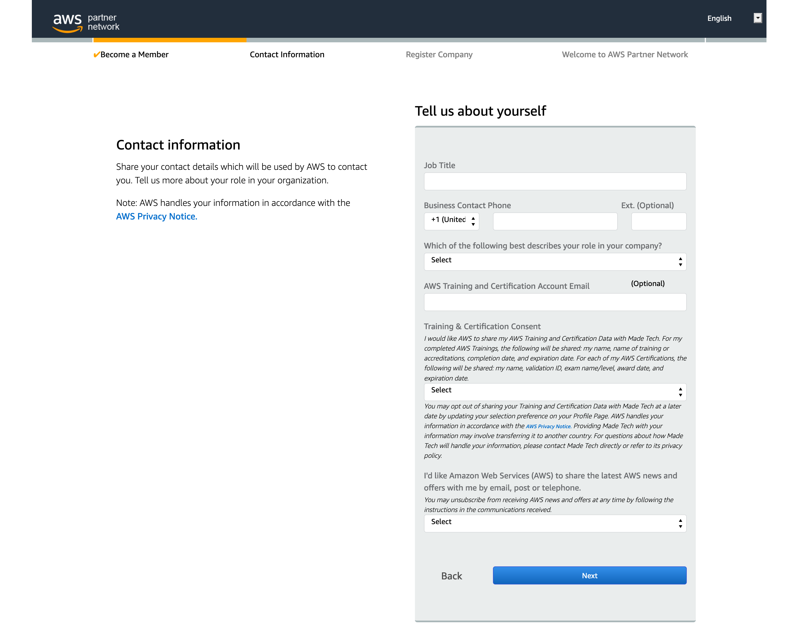
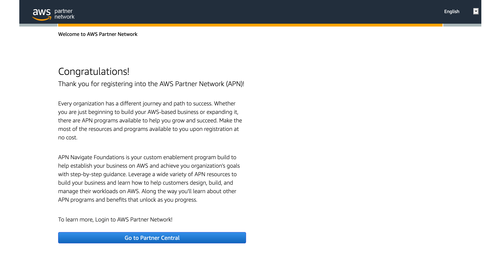

# AWS Partner Network

- [AWS Partner Network](#aws-partner-network)
  - [Registration](#registration)
    - [Step 1: Sign in](#step-1-sign-in)
    - [Step 2: Join AWS Partner Network](#step-2-join-aws-partner-network)
    - [Step 3: Let's get started](#step-3-lets-get-started)
    - [Step 4: Create an APN account](#step-4-create-an-apn-account)
    - [Step 5: Security code and password](#step-5-security-code-and-password)
    - [Step 6: Why would you like to join APN?](#step-6-why-would-you-like-to-join-apn)
    - [Step 7: Tell us about yourself](#step-7-tell-us-about-yourself)
    - [Step 8: Congratulations](#step-8-congratulations)

## Registration

### Step 1: Sign in

Go to the [aws.training sign in page](https://www.aws.training/SignIn) and click the right hand "Sign In" button to begin creating your Amazon Partner Network account.

### Step 2: Join AWS Partner Network

Click "Join AWS Partner Network"

### Step 3: Let's get started

Click "Let's get started"

### Step 4: Create an APN account

When creating an APN account you should use your **@madetech.com** email address to register.

Once you have registered, a security code will be emailed to you to use in the next step.

### Step 5: Security code and password

Enter the security code from the email you received along with a password.

### Step 6: Why would you like to join APN?

Select how you heard about APN and what you are looking for support with.

### Step 7: Tell us about yourself

Fill out your contact information, whether you consent to share training and certifications with MadeTech and whether you'd like to receive AWS news and offers.

**NOTE** 

- Use your **personal Amazon email** for the "AWS Training and Certification Account Email" section of the form in order to take your certifications with you should you leave MadeTech.

### Step 8: Congratulations

You have now registered for the AWS Partner Network

