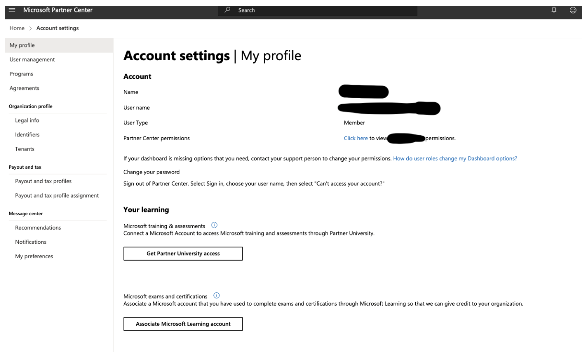

# Azure Certification

- [Azure Certification](#azure-certification)
  - [Purpose of this guide](#purpose-of-this-guide)
- [Azure Partnership](#azure-partnership)
- [Linking your Azure certifications to the Azure Partner Portal](#linking-your-azure-certifications-to-the-azure-partner-portal)

## Purpose of this guide

Made Tech are a Microsoft Azure Partner and require all Made Tech employees to link their Microsoft Certification Account to the Made Tech Azure Partner Portal as part of their onboarding process for a number of reasons.

 1. Access to free Azure Partner Training materials.
 2. Maintaining and aquiring partner levels with Azure.

# Azure Partnership

As a Made Tech employee you will be encouraged and supported in taking Azure Certifications. You are advised to create your Microsoft Certification account using a personal email address so any Azure Certifications you achieve belong to you. 

Azure has an extensive Training and Certification framework, and there is a lot of great content we can utilise as a Microsoft Azure Partner to develop and improve our knowledge when working with Azure services.

# Linking your Azure certifications to the Azure Partner Portal

In order for your Azure Certifications to appear within the Made Tech Azure Partner Portal, you need to link your personal Microsoft Certification Account to the Made Tech Azure Partner Portal.

Before you do this, you will need to have completed at least one exam or certification in the [Microsoft Learn portal](https://learn.microsoft.com/).

1. Go to the [Partner Portal](https://partner.microsoft.com/pc/Users/MyAccount).
2. Sign in using your **Made Tech Microsoft account**. This should take you to the account page, as shown below.
3. Click on the “Associate Microsoft Learning account” button.

4. This will take you to a new log-in page. Here enter your personal **Microsoft Certification Account** credentials (these are the ones you used to sign up for the exam).
5. This will then redirect you back to the above account page and show that you have successfully linked your accounts to the Partner Portal.
