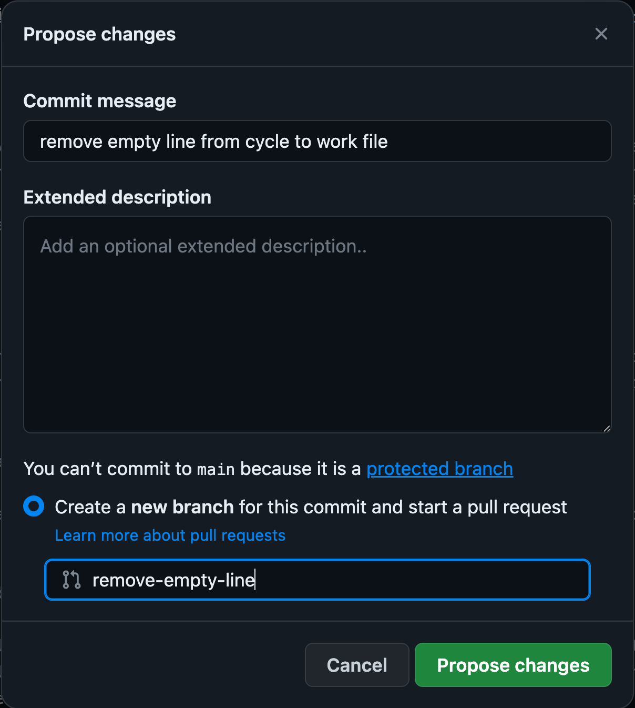
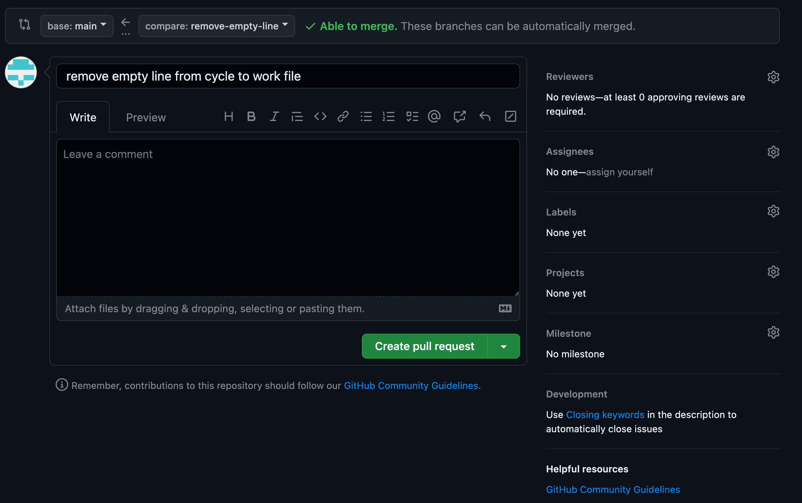
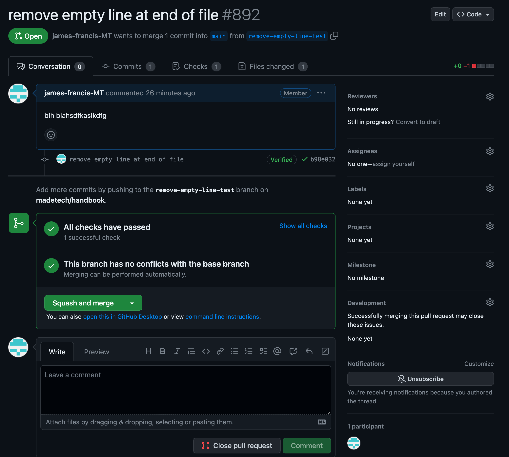

# Guide to making changes to the Made Tech handbook

## Via github UI - best for small changes (single file)

1. Goto the github page: [Handbook](https://github.com/madetech/handbook)
2. Navigate to the file you wish to change
3. Click on the pencil button in the top right of the file view
4. Make the changes
5. Click commit changes
6. Enter a message to describe the changes - you can add more detail in the details box
   
   
7. As main is protected we need to create a [pull request](https://docs.github.com/en/pull-requests/collaborating-with-pull-requests/proposing-changes-to-your-work-with-pull-requests/about-pull-requests)
8. Enter a name for your [branch](https://www.w3schools.com/git/git_branch.asp?remote=github) and click `Propose changes`
9.  Github will redirect to the `open pull request` page
    
10. Here you can describe your changes and click `Create pull request`
11. Once everything is green, you can get someone to review your changes and then click `Squash and merge`
    
12. The changes will now be in the main branch and visible to everyone viewing the handbook

---

## Via an IDE using git - best for more complex changes

*I've used [VSCode](https://code.visualstudio.com/) in the guide but you can use any text editor and terminal*

*A introduction to the command line can be found [here](https://tutorials.codebar.io/command-line/introduction/tutorial.html)*

### Setting up
1. Open up VSCode
2. In the explorer (can be found on the left at the top) click `Open Folder`
3. Select the folder in which you would like to [clone](https://github.com/git-guides/git-clone) the handbook
4. Open the terminal: `Terminal -> New Terminal`
5. In the terminal at the bottom, clone the repository:
   ```shell
   git clone https://github.com/madetech/handbook.git
   ```
6. cd into the folder you have just cloned:
   ```shell
   cd handbook
   ```
7. In the explorer you should be able to see the various files of the handbook

### Making changes
1. First we need to create a [branch](https://www.w3schools.com/git/git_branch.asp?remote=github)
   * Via the command line: (replace <your-branch-name> with a branch name - this should sum up your changes in a few words):
   ```shell
   git checkout -b <your-branch-name>
   ```
   * Via VSCode UI:
     * press `shift-command-p` to open the command palette
     * type 'branch' and click `Git: create branch from...`
     * select `main` from the list
     * enter a name for your branch

2. Now we have our own branch, we are ready to make our changes
3. Find the file where you wish to make a change and make your changes
4. The files use a language called [Markdown](https://www.markdownguide.org/getting-started/), you can see the syntax [here](https://github.com/adam-p/markdown-here/wiki/Markdown-Cheatsheet)

### Saving you changes
1. Once you have made a few small changes, its time to [add](https://github.com/git-guides/git-add) and [commit](https://github.com/git-guides/git-commit) those changes to your branch
   * Using the terminal:
      * Stage the files:
       ```shell
       git add .
       ```
      * Commit the files
       ```shell
       git commit -m '<some-message-describing-the-changes>'
       ```
   * Using the VSCode UI:
     * On the left hand side click the `Source control` tab
     * Here you can click on each file to review your changes
     * To stage your changes (add them), click small plus (+) next to each file
     * Once all of the files you wish to commit are staged, type a message in the box at the top and click `Commit`

2. Once you have made and committed the various changes, we can [push](https://github.com/git-guides/git-push) these up to Github
3. The first time you push your changes you will need to create an upstream tracking branch with a lasting relationship to your local branch
   ```shell
   git push -u origin <your-branch-name>
   ```
4. In the future you can simply run
   ```shell
   git push
   ```
    to push up your commits
5. Now our changes have been pushed to Github you can visit the [main page](https://github.com/madetech/handbook)
6. Click on the dropdown that currently says `main` and select your branch
7. It should say some thing along this lines of `This branch is x commits ahead of main.`
8. You can click the link to see your changes
9. If you are happy with your changes, click `create pull request` and follow the steps above (using the UI) [pull request](#via-github-ui---best-for-small-changes-single-file)

*Using an IDE + terminal is more complicated at first but offers more flexibility + it is good to get a good understanding of how git works*