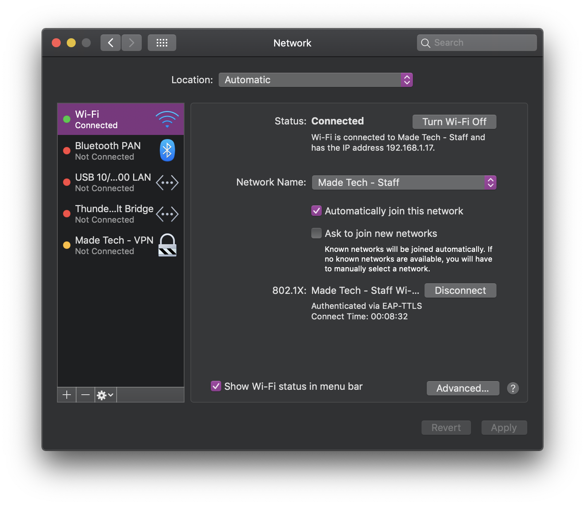
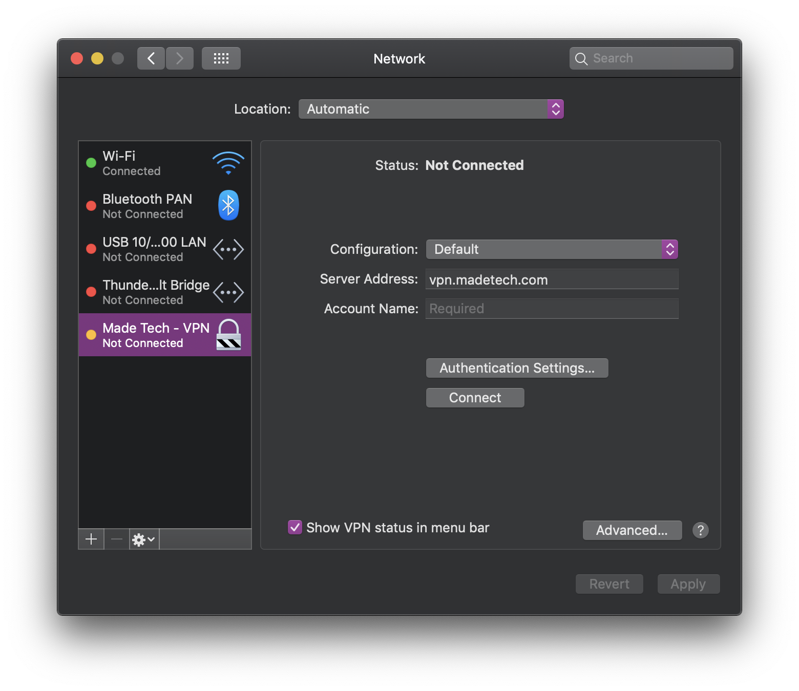
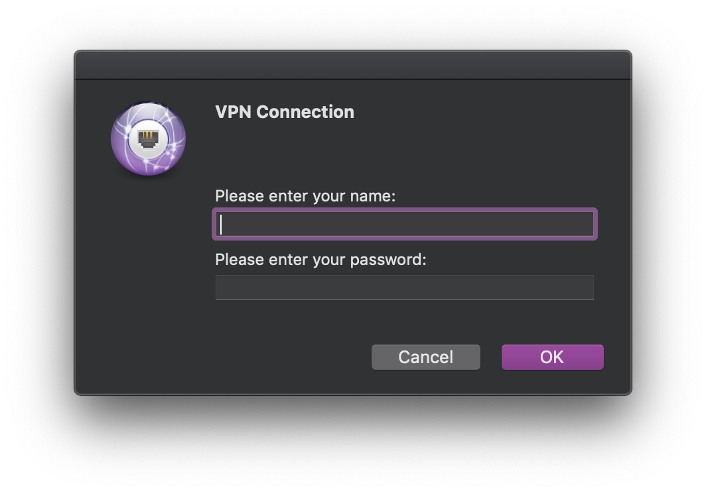

## Connecting to Made Tech - VPN

This is a guide for MacOS devices to connect to the Made Tech Virtual Private Network (VPN).

## MacOS

* Ensure you have the `Default` profile installed by checking **System Preferences** > **Profiles**. If you do not have this profile, please contact the ISMS team for assistance.
* Open **Network Preferences**. You can do this by clicking on the WiFi icon in the menu bar or by doing a Spotlight Search. You should see a screen that looks the image below.

Notice the `Made Tech - VPN`. This should automatically be there. Select the VPN.

Everything should already be configured. Check **Show Wi-Fi status in menu bar** for convenience (optional). Click **Connect**.

- The **Username** should be the local-part of your Made Tech email address
  - For example, if your email address was `jsmith@madetech.com`, your username would be `jsmith`
- The **Password** should be the same as your [G Suite](http://gsuite.google.com) password
- Click **OK**

That is it! You should now be connected to the `Made Tech - VPN`. If you are experiencing any problems, please contact the ISMS team.