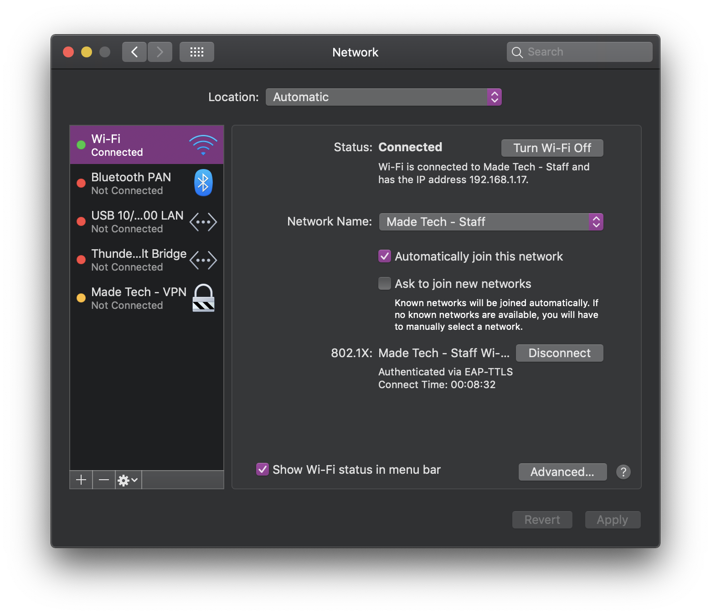
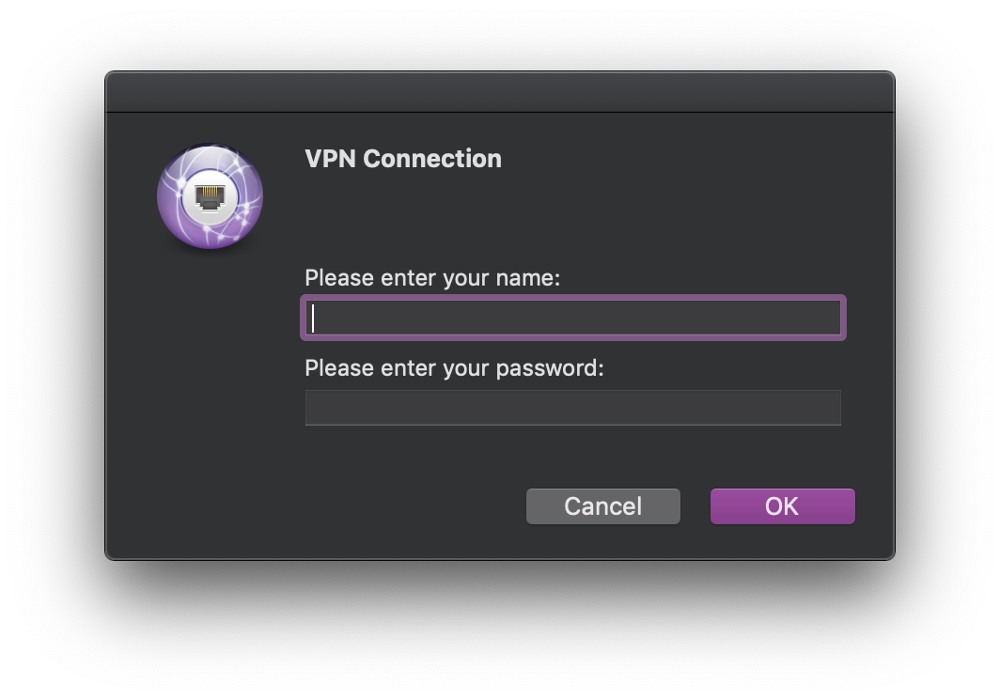
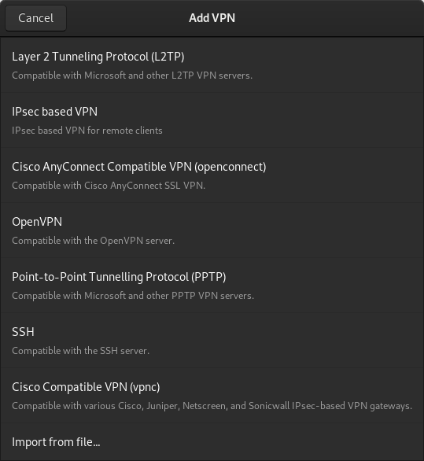
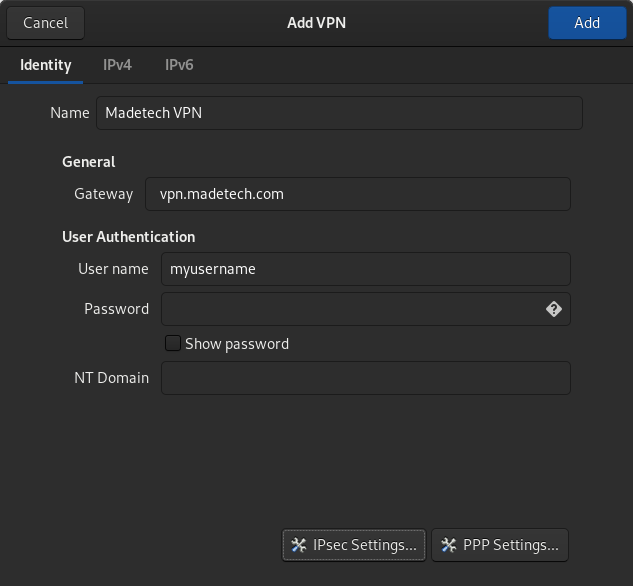
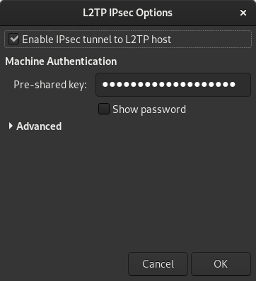
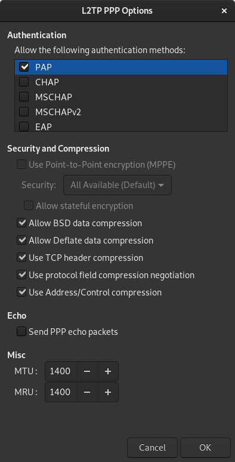

## Connecting to Made Tech - VPN

<hr/>

**Made Tech pay per MB for the usage of this VPN, therefore, please limit your usage to work only i.e no streaming videos**

<hr/>

This is a guide to connect to the Made Tech Virtual Private Network (VPN).

- [MacOS](#macos)
- [Linux](#linux)

## MacOS

* Ensure you have the `Default` profile installed by checking **System Preferences** > **Profiles**. If you do not have this profile, please contact the ISMS team for assistance.
* Open **Network Preferences**. You can do this by clicking on the WiFi icon in the menu bar or by doing a Spotlight Search. You should see a screen that looks like the image below.



Notice the `Made Tech - VPN`. This should automatically be there. Select the VPN.


Everything should already be configured. Check **Show Wi-Fi status in menu bar** for convenience (optional). Click **Connect**.



- The **Username** should be the local-part of your Made Tech email address
  - For example, if your email address was `jsmith@madetech.com`, your username would be `jsmith`
- The **Password** should be the same as your [G Suite](http://gsuite.google.com) password
- Click **OK**

That is it! You should now be connected to the `Made Tech - VPN`. If you are experiencing any problems, please contact the ISMS team.

## Linux 

### Ubuntu/Debian

Create the VPN connection by:

- Going to the Network section of Settings and clicking the `+` button near VPN
- Select _"Layer 2 Tunneling Protocol (L2TP)"_. If this option is not available see [Installing l2tp libraries](#installing-l2tp-libraries)
- Under "General" enter "madetechvpn.uksouth.cloudapp.azure.com" as the "Gateway"
- Under "User Authentication" enter your username and password (supplied by Systemagic)
- In _IPSec Settings_ enter the Pre-shared key (supplied by Systemagic)
- In _PPP Settings_ 
-- ensure that `MSCHAP` and `MSCHAPv2` are checked under _authentication options_ 
-- enable _"Use Point-to-Point encryption (MPPE)"_ 

#### Installing l2tp libraries

The Made Tech VPN uses the _Layer 2 Tunneling Protocol_ which may not be installed by default, but can be installed using:

```bash
sudo apt install network-manager-l2tp network-manager-l2tp-gnome
```

### Fedora

1. If you are using the GNOME version, first install the dependencies

```bash
# for GNOME
sudo dnf install NetworkManager-libreswan-gnome xl2tpd
```

2. Then you should be able to go to **settings** > **networking** and click the '+' add button



- Select the `Layer2 Tunneling Prootocol (L2TP)`

3. Main settings



- Enter the **Gateway** as `vpn.madetech.com`
- Your username (the local-part of your Made Tech email address before @madetech.com)
  - When prompted for password, you will have to enter your [G Suite](http://gsuite.google.com) password

4. Click the `IPsec Settings..` button



- Check the top checkbox and enter the shared secret (this will be provided to you)
- Click **OK**

5. Click the `PPP settings..` button



- Uncheck all auth methods except **PAP**
- Click **OK** and **Apply**
