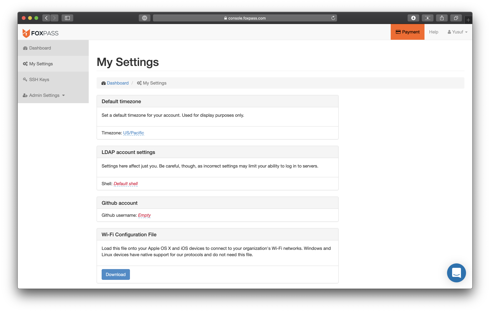
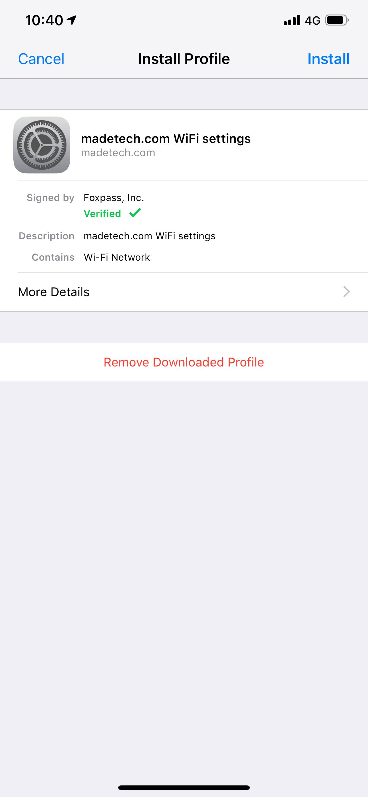
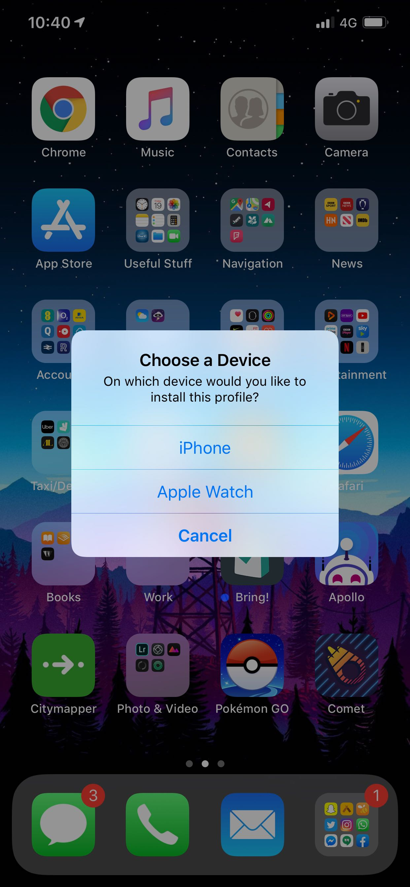
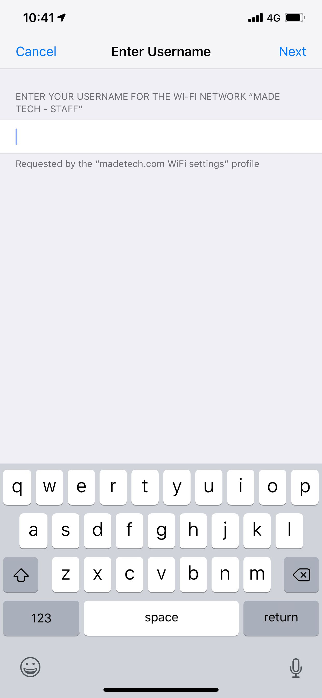
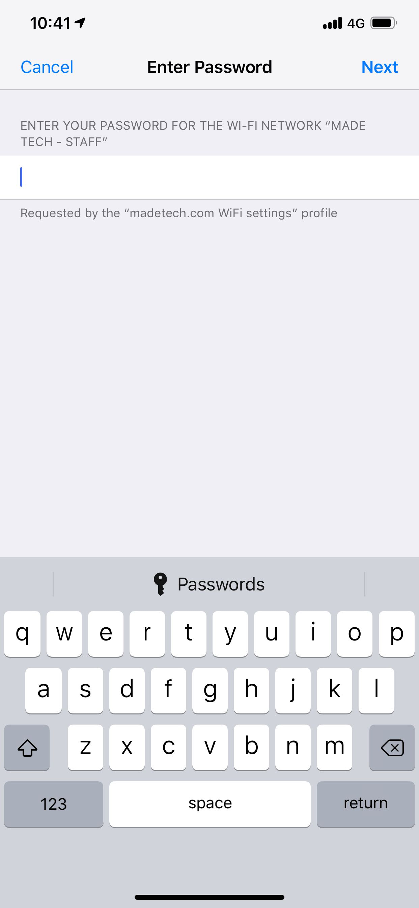

# iOS - WiFi Connection

To connect to the `Made Tech - Staff` network on an iOS device, you will need to install a `.mobileconfig` file. Login to [Foxpass](https://console.foxpass.com/login) on your phone/PC using **Sign in with Google** and navigate to the **My Settings** page.

Click on **Download** under the **WiFi configuration file**. Alternatively, you can save this on your PC and transfer it to your iOS device using AirDrop or any other convenient method. Once it is downloaded on your iOS device, go to **Settings** and click on the **Profile Downloaded** to begin the installation process.

Click on **Install** found at the top right and proceed with the installation.

Select your device for where you would like to install the profile. You will also have to enter your device **passcode** after selection.

- For the **Username**, it should be the local-part of your Made Tech email address
  - For example, if your email address was `jsmith@madetech.com`, your username would be `jsmith`.

- The **Password** should be the same as your [G Suite](http://gsuite.google.com) password.

Click **Next** to finish installing the profile.

That is it! You should now be automatically connected to the `Made Tech - Staff` network. If you are experiencing any problems, please contact the ISMS team.
