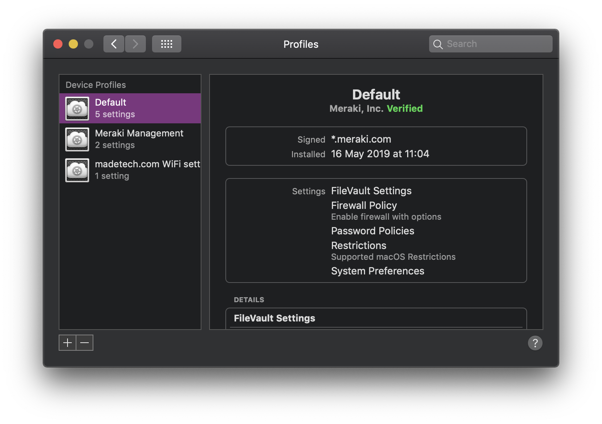

# MacOS - WiFi Connection

This guide depends on your MacOS device being enrolled in the Cisco Meraki Systems Manager. You can check by going to **System Preferences** > **Profiles**. It should look something like this.

The `madetech.com WiFi setting` profile is required to connect to the `Made Tech - Staff` WiFi. If you do not have this, contact the ISMS team.

Click on the `Made Tech - Staff` SSID in the WiFi dropdown. You should be presented with a screen that asks for your username and password.

- The **Username** should be the local-part of your Made Tech email address
  - For example, if your email address was `jsmith@madetech.com`, your username would be `jsmith`
- The **Password** should be the same as your [G Suite](http://gsuite.google.com) password.

That is it! You should now be connected. If you are experiencing any problems, please do not hesitate to contact any of the team.
